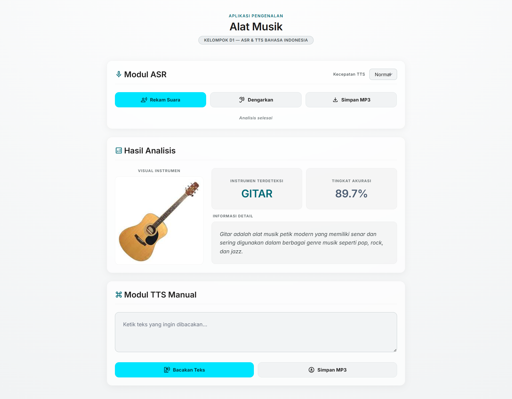

# 🎵 Pengembangan Aplikasi Pengenalan Nama Alat Musik Tradisional dan Modern Menggunakan Automatic Speech Recognition dan Text-to-Speech Berbahasa Indonesia

Aplikasi web berbasis Python dan Flask untuk mengenali jenis alat musik dari suara yang direkam secara langsung menggunakan mikrofon. Sistem menggunakan ekstraksi fitur MFCC dan algoritma Multi Layer Perceptron (MLP) untuk melakukan klasifikasi.

---

## 📌 Fitur

- Rekam suara langsung dari mikrofon
- Klasifikasi otomatis alat musik
- Menampilkan tingkat kepercayaan (confidence)
- Menampilkan informasi alat musik
- Text To Speech (TTS) menggunakan Google Text-to-Speech
- Model Machine Learning berbasis MLP
- Ekstraksi fitur audio menggunakan MFCC

---

## 🎯 Kelas Alat Musik

Sistem dapat mengenali 10 alat musik:

1. Angklung
2. Biola
3. Drums
4. Gamelan
5. Gitar
6. Gong
7. Kendang
8. Piano
9. Suling
10. Terompet

---

## 🛠 Teknologi yang Digunakan

### Backend
- Python
- Flask

### Machine Learning
- Scikit-Learn
- MLPClassifier

### Audio Processing
- Librosa
- NumPy
- SoundDevice

### Frontend
- HTML
- CSS
- JavaScript

### Text To Speech
- gTTS (Google Text To Speech)

---

## 📂 Struktur Project

```text
project-ptu/
│
├── dataset/
│   ├── angklung/
│   ├── biola/
│   ├── drums/
│   ├── gamelan/
│   ├── gitar/
│   ├── gong/
│   ├── kendang/
│   ├── piano/
│   ├── suling/
│   └── terompet/
│
├── static/
│   ├── images/
│   ├── css/
│   └── js/
│
├── templates/
│   └── index.html
│
├── app.py
├── training.py
├── rekam.py
├── konversi.py
├── model.pkl
├── scaler.pkl
└── README.md
```

---

## ⚙️ Metode Ekstraksi Fitur

Audio diproses menggunakan MFCC (Mel Frequency Cepstral Coefficients).

Fitur yang digunakan:

| Fitur | Jumlah |
|---------|---------|
| MFCC Mean | 40 |
| MFCC Std | 40 |
| Delta MFCC Mean | 40 |
| Delta² MFCC Mean | 40 |
| Total Fitur | 160 |

### Tahapan

1. Membaca file audio
2. Ekstraksi 40 MFCC
3. Menghitung rata-rata MFCC
4. Menghitung standar deviasi MFCC
5. Menghitung Delta MFCC
6. Menghitung Delta² MFCC
7. Menggabungkan seluruh fitur menjadi 160 fitur

---

## 📈 Data Augmentation

Untuk meningkatkan variasi data, dilakukan augmentasi:

### 1. Noise Injection

Menambahkan noise kecil ke sinyal audio.

```python
audio_noise = audio + (0.003 * noise)
```

### 2. Pitch Shifting

Mengubah tinggi nada suara.

```python
audio_pitch = librosa.effects.pitch_shift(
    audio,
    sr=sr,
    n_steps=1
)
```

Setiap file audio menghasilkan:

- Data asli
- Data dengan noise
- Data dengan pitch shift

Sehingga jumlah data bertambah 3 kali lipat.

---

## 🧠 Arsitektur Model

Model yang digunakan:

```python
MLPClassifier(
    hidden_layer_sizes=(128, 64),
    activation='relu',
    solver='adam',
    alpha=0.0001,
    learning_rate_init=0.0005,
    max_iter=8000,
    random_state=42
)
```

### Parameter

| Parameter | Nilai |
|------------|---------|
| Hidden Layer 1 | 128 neuron |
| Hidden Layer 2 | 64 neuron |
| Activation | ReLU |
| Optimizer | Adam |
| Learning Rate | 0.0005 |
| Max Iteration | 8000 |

---

## 🔄 Alur Sistem

```text
Suara Mikrofon
       ↓
Ekstraksi MFCC
       ↓
Normalisasi Data
       ↓
Model MLP
       ↓
Prediksi Kelas
       ↓
Menampilkan Informasi Alat Musik
       ↓
Text To Speech
```

---

## 🚀 Instalasi

### Clone Repository

```bash
git clone https://github.com/username/project-ptu.git
cd project-ptu
```

### Install Dependency

```bash
pip install -r requirements.txt
```

Atau:

```bash
pip install flask
pip install librosa
pip install numpy
pip install sounddevice
pip install scikit-learn
pip install matplotlib
pip install seaborn
pip install gtts
```

---

## ▶️ Training Model

Jalankan:

```bash
python training.py
```

Output:

```text
model.pkl
scaler.pkl
```

akan dibuat secara otomatis.

---

## 📊 Evaluasi Model

Evaluasi dilakukan menggunakan:

- Accuracy
- Classification Report
- Confusion Matrix

Contoh metrik:

```text
Precision
Recall
F1-Score
Accuracy
```

Visualisasi confusion matrix akan disimpan pada:

```text
confusion_matrix.png
```

---

## ▶️ Menjalankan Aplikasi

```bash
python app.py
```

Buka browser:

```text
http://127.0.0.1:5000
```

---

## 📸 Tampilan Sistem

<p align="center">
  
</p>


## 👨‍💻 Pengembang

### Grup – D1

| NIM | Nama |
|------|------|
| 152023132 | Muhammad Abu Yusuf |
| 152023150 | Reza Zakaria |
| 152023155 | Pasha Muhamad Nashwan |
| 152023161 | Nouval M Abdul Rojak |
| 152023219 | Merry Gabriella Angel S |

